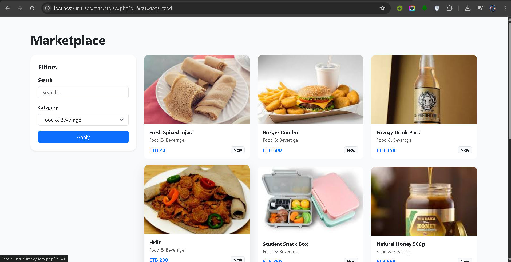
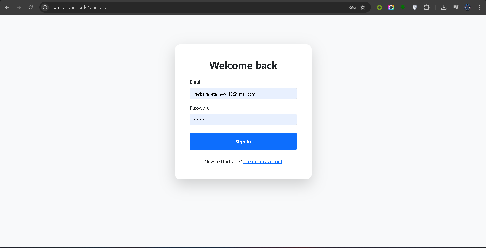
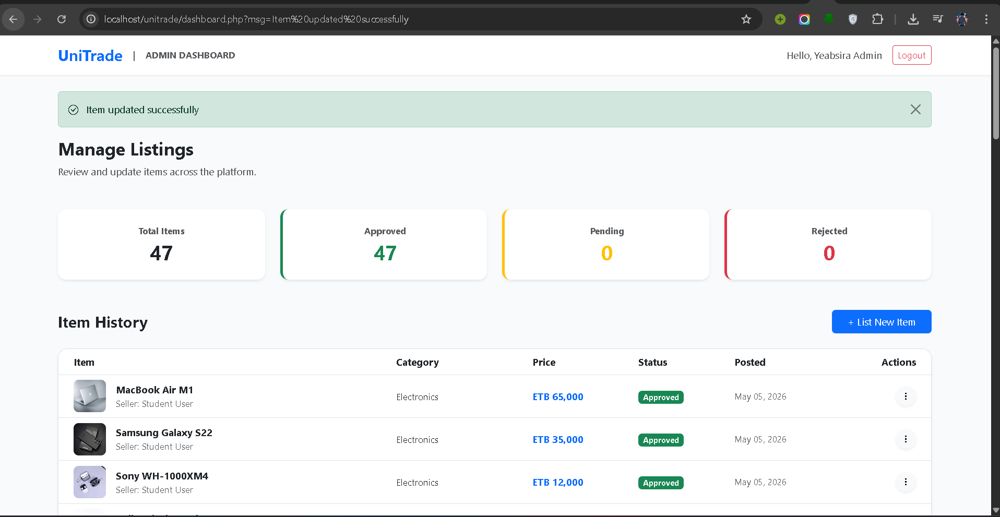

# 🎓 UniTrade - Student Marketplace & Resource Exchange System

## 🏫 Adama Science and Technology University (ASTU)
**Department of Software Engineering**

**Course Title:** Engineering Web Based System  
**Course Code:** SEng3202  

**Project Title:** UniTrade Student Marketplace & Resource Exchange System  

**Submitted to:** Mr. Alemayew Megersa  
**Submission Date:** May 06, 2026  

---

## 👨‍💻 Team Members

| Name | ID |
|------|-----|
| Faysel Nessro | UGR/34398/16 |
| Eyoab Nigusie | UGR/34353/16 |
| Fitsum Kurabachew | UGR/34462/16 |
| Simret Mesfin | UGR/35426/16 |
| Yeabsira Getachew | UGR/35614/16 |

---

## 📌 Project Overview

UniTrade is a **web-based marketplace platform** designed specifically for ASTU students.  
It allows users to **buy, sell, and exchange items** within the campus community.

### 🛍️ Categories
- Electronics  
- Stationery  
- Clothes  
- Shoes  
- Food  

💰 All transactions are displayed in **Ethiopian Birr (ETB)**.

---

## 🛠️ Technologies Used

### Frontend
- HTML5  
- CSS3  
- Bootstrap 5  
- Bootstrap Icons  

### Backend
- PHP (Procedural + OOP)

### Database
- MySQL  

### Server
- XAMPP (Apache + MySQL)

### Assets
- Unsplash API (for product images)

---

## ✨ Features

### 🏠 Home Page
- Modern hero section  
- Category navigation  
- Featured items dynamically loaded  

---

### 🛒 Marketplace
- 50+ preloaded items  
- Category filtering  
- Product cards with:
  - Price (ETB)
  - Condition
  - Category  

---

### 🔐 User Authentication
- Signup with Gmail  
- Secure login (password hashing)  
- User profile system  

---

### 📊 Admin Dashboard
- Total Items  
- Approved / Pending / Rejected stats  
- Full item listing table  

---

### ⚙️ Item Management
- Add items  
- Update items  
- Delete items  
- Image upload support  

---

## 🧱 System Implementation

- Database design (`database.sql`)
- Data seeding (`seed.sql`) with 50 items  
- Secure DB connection using PDO  
- Responsive UI (mobile + desktop)  
- Role-Based Access Control (Admin only features)  
- Image handling (URL + upload system)  

---

## 🖼️ Screenshots

### 🏠 Home Page

### 🛒 Marketplace

### 🔐 Login Page

### 📊 Admin Dashboard

## ⚙️ How to Run the Project

### 1️⃣ Install XAMPP
Download from: https://www.apachefriends.org/

---

### 2️⃣ Setup Project
- Copy project folder to: